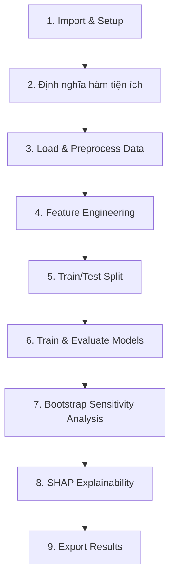
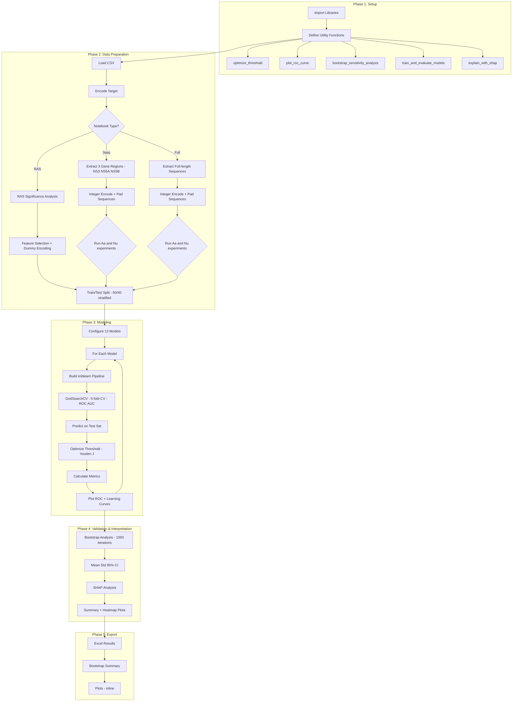

# Luồng Thực Thi — Các Notebooks Dự Đoán Mô Hình

## Tổng Quan

Tài liệu này mô tả chi tiết luồng chạy hiện tại của ba notebooks:
- `Predictive_model_ras.ipynb` — Phân tích đặc trưng RAS
- `Predictive_model_3seq.ipynb` — Phân tích đặc trưng 3seq
- `Predictive_model_full.ipynb` — Phân tích bộ đặc trưng đầy đủ

Cả ba notebooks đều chia sẻ **kiến trúc pipeline giống nhau** nhưng khác nhau ở dữ liệu đầu vào và bước tiền xử lý đặc thù.

---

## Kiến Trúc Chung



---

## Bước 1: Import & Thiết Lập Môi Trường

### Thư viện sử dụng
```python
# Core
import os, warnings, numpy, pandas, matplotlib

# Sklearn
from sklearn.model_selection import train_test_split, GridSearchCV
from sklearn.preprocessing import StandardScaler
from sklearn.decomposition import PCA
from sklearn.feature_selection import VarianceThreshold
from sklearn.base import BaseEstimator, TransformerMixin

# Models
from sklearn.svm import SVC
from sklearn.linear_model import LogisticRegression
from sklearn.ensemble import RandomForestClassifier, GradientBoostingClassifier
from sklearn.tree import DecisionTreeClassifier
from sklearn.neighbors import KNeighborsClassifier
from sklearn.naive_bayes import GaussianNB
from sklearn.neural_network import MLPClassifier
from sklearn.ensemble import VotingClassifier, StackingClassifier
from sklearn.discriminant_analysis import QuadraticDiscriminantAnalysis

# Imbalanced-learn
from imblearn.over_sampling import SMOTE
from imblearn.pipeline import Pipeline

# Sequence encoding (3seq & Full notebooks only)
from tensorflow.keras.preprocessing.sequence import pad_sequences

# Custom
from model_utils import FiniteClipper
```

### Cấu hình
- Tắt tất cả warnings: `warnings.simplefilter("ignore")`
- Tắt NumPy floating-point warnings: `np.seterr(all="ignore")`

---

## Bước 2: Định Nghĩa Hàm Tiện Ích

### 2.1. `optimize_threshold(y_true, y_proba)`
**Mục đích**: Tìm ngưỡng quyết định tối ưu bằng Youden's J.

```
Input: y_true (labels), y_proba (predicted probabilities)
  → Tính ROC curve (fpr, tpr, thresholds)
  → Lọc giá trị hữu hạn
  → Tính Youden's J = TPR - FPR
  → Chọn threshold tại argmax(J)
Output: best_threshold, fpr, tpr
```

### 2.2. `plot_roc_curve(fpr, tpr, auc_score, label)`
**Mục đích**: Vẽ đường ROC curve cho từng model.

### 2.3. `bootstrap_sensitivity_analysis(results, n_bootstraps=1000, ...)`
**Mục đích**: Phân tích độ nhạy bằng bootstrap resampling.

```
Input: results dict chứa models, X_test, y_test
  → Với mỗi model:
    → Lặp n_bootstraps lần:
      → Random sample có hoàn lại từ test set
      → Kiểm tra có đủ 2 lớp
      → Dự đoán xác suất
      → Tối ưu ngưỡng
      → Tính 5 metrics: Accuracy, Precision, Recall, F1, AUC
    → Tổng hợp: mean, std, 95% CI
  → Lưu Excel + in kết quả
Output: DataFrame tổng hợp, file Excel
```

### 2.4. `train_and_evaluate_models(models_config, X_train, y_train, X_test, y_test, ...)`
**Mục đích**: Hàm chính huấn luyện và đánh giá.

```
Input: configs, data splits, save_path
  → Với mỗi model:
    → Tạo Pipeline: VarianceThreshold → StandardScaler → SMOTE → FiniteClipper → Model
    → GridSearchCV(pipeline, param_grid, cv=5, scoring="roc_auc")
    → Fit trên (X_train, y_train)
    → Dự đoán trên X_test
    → Tối ưu ngưỡng
    → Tính metrics + confusion matrix
    → Vẽ ROC curve + Learning curve
    → Lưu vào results dict
Output: results dict chứa tất cả models, metrics, data
```

### 2.5. `explain_with_shap(results, save_path)`
**Mục đích**: Phân tích giải thích mô hình bằng SHAP.

```
Input: results dict
  → Với mỗi model:
    → Lấy pipeline đã fit
    → Transform X_test qua các bước preprocessing
    → Tạo KernelExplainer(predict_fn, background=50 samples)
    → Tính SHAP values cho 20 mẫu test
    → Vẽ summary plot + heatmap
Output: SHAP plots
```

---

## Bước 3: Load & Tiền Xử Lý Dữ Liệu

### Predictive_model_ras.ipynb

```
1. Load CSV: data_complete.csv
2. Mã hóa biến mục tiêu:
   - "Non SVR" → 1
   - "SVR" → 0
3. Gọi analyze_ras_significance():
   - Đọc file RAS mutations
   - Fisher's exact test cho mỗi mutation
   - Lọc theo alpha=0.05, min_support=3
4. Trích xuất RAS features
5. Kết quả: DataFrame chỉ chứa RAS features + target
```

### Predictive_model_3seq.ipynb

```
1. Load CSV: data_complete.csv
2. Mã hóa biến mục tiêu:
   - Mapping: {'Yes': 1, 'No': 0, 'SVR': 0, 'Non SVR': 1, 'SVR ': 0, 'Non SVR ': 1}
3. Trích xuất trình tự từ 3 vùng gene: NS3, NS5A, NS5B
4. Chạy 2 thí nghiệm riêng biệt:

   [Amino Acid]:
   - Đọc cột trình tự amino acid cho mỗi vùng gene
   - Mã hóa: amino acid → integers 1–20 (alphabet "ACDEFGHIKLMNPQRSTVWY")
   - Unknown/missing → 0
   - Padding: pad_sequences(maxlen=max_seq_len, padding='post', value=0)
   - Ghép nối 3 vùng → flatten thành mảng 2D: (n_samples, 3 × max_seq_len)

   [Nucleotide]:
   - Đọc cột trình tự nucleotide cho mỗi vùng gene
   - Mã hóa: {A:1, C:2, G:3, T:4}, unknown → 0
   - Padding: pad_sequences(maxlen=max_seq_len, padding='post', value=0)
   - Ghép nối 3 vùng → flatten thành mảng 2D: (n_samples, 3 × max_seq_len)

5. Kết quả: 2 feature matrices (Aa và Nu) + target
```

### Predictive_model_full.ipynb

```
1. Load CSV: data_complete.csv
2. Mã hóa biến mục tiêu (giống 3seq)
3. Chạy 2 thí nghiệm riêng biệt:

   [Amino Acid]:
   - Đọc cột 'Full aa' — trình tự amino acid đầy đủ
   - Mã hóa: amino acid → integers 1–20 (giống 3seq)
   - Padding: pad_sequences(maxlen=max_seq_len, padding='post', value=0)
   - Flatten thành mảng 2D: (n_samples, max_seq_len)

   [Nucleotide]:
   - Đọc cột 'Full Nu' — trình tự nucleotide đầy đủ
   - Mã hóa: {A:1, C:2, G:3, T:4} (giống 3seq)
   - Padding: pad_sequences(maxlen=max_seq_len, padding='post', value=0)
   - Flatten thành mảng 2D: (n_samples, max_seq_len)

4. Kết quả: 2 feature matrices (Aa và Nu) + target

⚠️ Khác biệt với 3seq: Full sử dụng 1 trình tự nguyên vẹn thay vì
   ghép nối 3 vùng gene riêng biệt → số chiều features khác nhau
```

---

## Bước 4: Feature Engineering

### Predictive_model_ras.ipynb
```
1. Tạo dummy variables cho genotype columns (one-hot encoding)
2. Loại bỏ cột genotype gốc
3. Kết hợp features đã mã hóa với DataFrame chính
```

### Predictive_model_3seq.ipynb & Predictive_model_full.ipynb
```
1. Sequence encoding đã hoàn thành ở Bước 3 (integers + padding)
2. Không cần dummy encoding — features đã ở dạng numerical
3. Mỗi notebook chạy 2 thí nghiệm (Amino Acid + Nucleotide) tuần tự
```

---

## Bước 5: Train/Test Split

```python
X_train, X_test, y_train, y_test = train_test_split(
    X, y,
    test_size=0.4,      # 40% test
    random_state=42,     # reproducibility
    stratify=y           # giữ tỷ lệ lớp
)
```

### Phân bố (RAS notebook)
- **Total**: 162 mẫu
- **Train**: ~97 mẫu (60%)
- **Test**: ~65 mẫu (40%)
- **Class 0 (SVR)**: 101 (~62%)
- **Class 1 (Non SVR)**: 61 (~38%)

---

## Bước 6: Train & Evaluate Models

### Cấu hình 13 mô hình

| # | Model | Hyperparameter Grid Size |
|---|-------|--------------------------|
| 1 | SVM (with PCA) | 9 tổ hợp |
| 2 | Elastic Net | 12 tổ hợp |
| 3 | Random Forest | 8 tổ hợp |
| 4 | GBM | 8 tổ hợp |
| 5 | Decision Tree | 6 tổ hợp |
| 6 | FDA (QDA) | 3 tổ hợp |
| 7 | KNN | 6 tổ hợp |
| 8 | Logistic Regression | 4 tổ hợp |
| 9 | Naive Bayesian | 3 tổ hợp |
| 10 | Neural Network (MLP) | 6 tổ hợp |
| 11 | Voting Classifier | 1 (no tuning) |
| 12 | Stacking Classifier | 1 (no tuning) |
| 13 | XGBoost | 32 tổ hợp |

### Pipeline cho mỗi model
```
VarianceThreshold(threshold=0.0)
  → StandardScaler()
  → SMOTE(random_state=42)
  → FiniteClipper()   [custom: clip & impute NaN/Inf]
  → Classifier
```

### Quy trình đánh giá cho mỗi model
```
1. GridSearchCV fit → best_estimator_
2. predict_proba trên X_test
3. optimize_threshold → best threshold
4. Phân loại theo threshold
5. Tính metrics:
   - Accuracy, Precision, Recall, F1, AUC
   - Confusion Matrix
6. Vẽ biểu đồ:
   - ROC Curve
   - Learning Curve
```

---

## Bước 7: Bootstrap Sensitivity Analysis

```
Sau khi tất cả models được train:
  → Gọi bootstrap_sensitivity_analysis(results, n_bootstraps=1000)
  → 1000 lần resampling test set
  → Tính 5 metrics cho mỗi lần
  → Báo cáo: mean, std, 95% CI
  → Lưu file Excel
```

---

## Bước 8: SHAP Explainability

```
Gọi explain_with_shap(results, save_path):
  → Với mỗi model đã train:
    → Trích xuất preprocessing steps từ pipeline
    → Transform test data
    → KernelExplainer với 50 background samples
    → Tính SHAP values cho 20 test samples
    → Vẽ Summary Plot (bee swarm)
    → Vẽ Heatmap
```

---

## Bước 9: Export Kết Quả

### Output files

**RAS notebook** (trong thư mục `outputs/`):
- `*_results.xlsx` — Metrics tổng hợp cho tất cả models
- `*_bootstrap_summary.xlsx` — Bootstrap sensitivity analysis
- ROC curve plots, Learning curve plots, SHAP plots (hiển thị inline)

**3seq notebook** (trong thư mục `outputs/`):
- `outputs/Experiment_Aa_<timestamp>/` — Kết quả Amino Acid
- `outputs/Experiment_Nu_<timestamp>/` — Kết quả Nucleotide
- Mỗi thư mục chứa: Excel results, bootstrap summary, plots

**Full notebook** (trong thư mục `outputs/`):
- `outputs/Experiment_Aa_<timestamp>/` — Kết quả Amino Acid
- `outputs/Experiment_Nu_<timestamp>/` — Kết quả Nucleotide
- Mỗi thư mục chứa: Excel results, bootstrap summary, plots

---

## Sơ Đồ Luồng Chi Tiết



---

## Khác Biệt Giữa 3 Notebooks

| Đặc điểm | RAS | 3seq | Full |
|-----------|-----|------|------|
| Input features | RAS mutations + genotype | Trình tự 3 vùng gene (NS3, NS5A, NS5B) | Trình tự đầy đủ (full-length) |
| Nguồn dữ liệu | Cột mutation + genotype | Cột sequence cho 3 vùng | Cột 'Full aa' / 'Full Nu' |
| Mã hóa features | Numerical + one-hot genotype | Integer encoding + padding | Integer encoding + padding |
| Số thí nghiệm | 1 | 2 (Amino Acid + Nucleotide) | 2 (Amino Acid + Nucleotide) |
| RAS significance analysis | ✅ Có | ❌ Không | ❌ Không |
| Fisher's exact test | ✅ Có | ❌ Không | ❌ Không |
| Sequence padding | ❌ Không | ✅ pad_sequences (3 vùng ghép nối) | ✅ pad_sequences (1 trình tự) |
| Số lượng features | Thấp (RAS only) | Trung bình (3 × max_seq_len) | Cao (max_seq_len) |
| Pipeline structure | Giống nhau | Giống nhau | Giống nhau |
| Models used | 13 models | 13 models | 13 models |
| Hyperparameter grids | Giống nhau | Giống nhau | Giống nhau |
| Bootstrap iterations | 1000 | 1000 | 1000 |
| SHAP analysis | ✅ Có | ✅ Có | ✅ Có |
| Output directories | `outputs/` | `outputs/Experiment_Aa_*/`, `outputs/Experiment_Nu_*/` | `outputs/Experiment_Aa_*/`, `outputs/Experiment_Nu_*/` |
| Best CV AUC | 0.8845 (RF) | 0.8973 (XGBoost, Nu) | 0.9045 (Elastic Net, Aa) |
| Thư viện bổ sung | — | tensorflow/keras (pad_sequences) | tensorflow/keras (pad_sequences) |

---

## Ghi Chú Kỹ Thuật

### FiniteClipper (model_utils.py)
```python
class FiniteClipper(BaseEstimator, TransformerMixin):
    """
    Thay thế giá trị ±Inf bằng min/max của dữ liệu hữu hạn.
    Impute NaN bằng median.
    """
    def fit(self, X, y=None): ...
    def transform(self, X): ...
```

### Lưu ý về SMOTE trong Pipeline
- SMOTE chỉ được áp dụng trong quá trình `fit` (training)
- Không áp dụng khi `predict` → đúng thực hành ML
- `imblearn.pipeline.Pipeline` (không phải `sklearn.pipeline.Pipeline`) đảm bảo điều này

### Sequence Encoding (3seq & Full notebooks)
- **Amino Acid alphabet**: "ACDEFGHIKLMNPQRSTVWY" → integers 1–20, unknown → 0
- **Nucleotide mapping**: {A:1, C:2, G:3, T:4}, unknown → 0
- **Padding**: `pad_sequences(maxlen=max_seq_len, padding='post', value=0)`
- **3seq**: Ghép nối 3 vùng gene → shape: `(n_samples, 3 × max_region_len)`
- **Full**: 1 trình tự → shape: `(n_samples, max_full_len)`
- Padding value 0 đóng vai trò như "missing" indicator, được xử lý bởi VarianceThreshold nếu variance = 0

### Lưu ý về SVM trên Full features
- SVM + PCA(0.95) thất bại nghiêm trọng trên Full features (test AUC ~0.12)
- CV AUC bình thường (~0.84), cho thấy overfitting trong cross-validation
- Nguyên nhân có thể: PCA trên full-length padded sequences tạo components không đại diện

---

*Tài liệu được tạo tự động dựa trên phân tích mã nguồn.*
